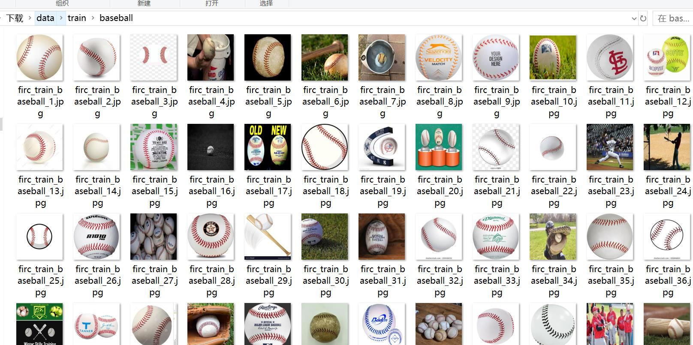
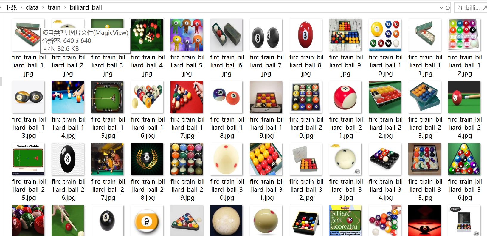
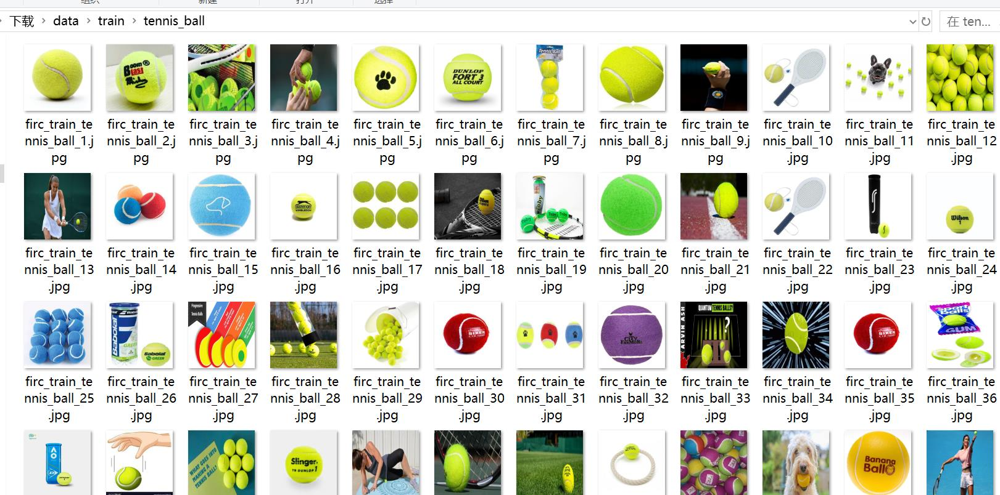
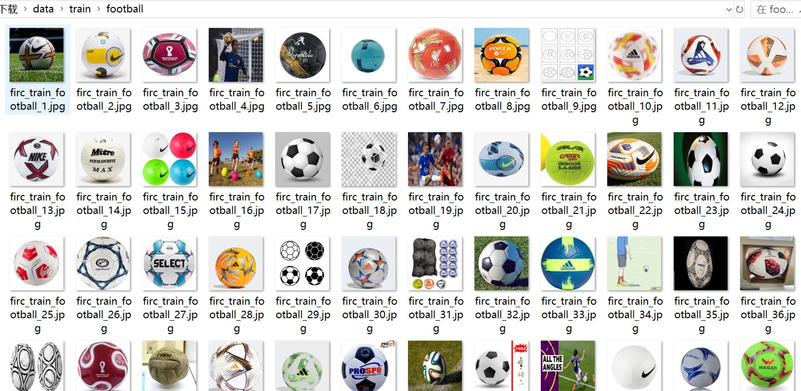

# 15-Class Sports Ball Image Classification Dataset with 7327 Images

Dataset Type: Image Classification for use in target detection without annotation files.  
Dataset Format: Only includes JPG images, each category folder contains the corresponding image.  
Number of Images (JPG file count): 7327  
Number of Categories: 15  
Category Names: ['american_football', 'baseball', 'basketball', 'billiard_ball', 'bowling_ball', 'cricket_ball', 'football', 'golf_ball', 'hockey_ball', 'hockey_puck', 'rugby_ball', 'shuttlecock', 'table_tennis_ball', 'tennis_ball', 'volleyball']  
Image Count per Category:  
Training set image count: 5129  
- American football Training set image count: 266
- Baseball Training set image count: 280
- Basketball Training set image count: 233
- Billiard ball Training set image count: 449
- Bowling ball Training set image count: 311
- Cricket ball Training set image count: 420
- Football Training set image count: 399
- Golf ball Training set image count: 381
- hockey_balltraining set image count: 374
- hockey_pucktraining set image count: 270
- rugby_balltraining set image count: 342
- shuttlecocktraining set image count: 302
- table_tennis_balltraining set image count: 442
- tennis_balltraining set image count: 353
- volleyballtraining set image count: 307
Validation set image count: 1465
- american_footballvalidation set image count: 80
- baseballvalidation set image count: 81
- basketballvalidation set image count: 67
- billiard_ballvalidation set image count: 136
- bowling_ballvalidation set image count: 90
- cricket_ballvalidation set image count: 111
- footballvalidation set image count: 133
- golf_ballValidation set image count: 108
- hockey_ballValidation set image count: 99
- hockey_puckValidation set image count: 79
- rugby_ballValidation set image count: 104
- shuttlecockValidation set image count: 79
- table_tennis_ballValidation set image count: 126
- tennis_ballValidation set image count: 95
- volleyballValidation set image count: 77
Test set image count: 733  
- American football (American Football) Test set image count: 38
- Baseball (Baseball) Test set image count: 39
- basketball (basketball) Test set image count: 40
- billiard_ballTest set image count: 61
Bowling_ball (bowling) Test set image count: 39
- cricket_ballTest set image count: 50
- footballtest set image count: 72
- golf_balltest set image count: 60
- hockey_balltest set image count: 57
- hockey_pucktest set image count: 41
- rugby_balltest set image count: 46
- shuttlecocktest set image count: 48
- table_tennis_balltest set image count: 52
- tennis_balltest set image count: 42
- Volleyball (volleyball) Test Set Image Count: 48
total images:   
- American football is the most popular sport in the United States. It's a team sport that involves two teams of 11 players each, and it takes place on a field with a goal line at one end and a goal box at the other. The game lasts for about two hours, with each team having possession of the ball for 30 minutes before switching to the other team. The objective of the game is to score more points than the opposing team by running, passing, or catching the ball in their own end zone.
- baseball total image count: 400  
- basketball total image count: 340  
- billiard_ball total image count: 646
Bowling ball (pinball) total image count: 440
- Cricket ball total image count: 581
- football (English football) total image count: 604
- golf_ball (Golf ball) total image count: 549
- hockey_balltotal image count: 530
- hockey_pucktotal image count: 390
- rugby_balltotal image count: 492
- shuttlecock (Badminton) total picture count: 429
- table_tennis_ball total image count: 620
- tennis_ball total image count: 490
- Volleyball (volleyball) total picture count: 432
Important Notice: None
Special notice: This dataset does not guarantee the accuracy of the trained model or weight files.
Image preview:
## Images

Here is a pay link on Stripe ( https://buy.stripe.com/3cs8yP7sY87d0vu9AB ). Please contact me lonlonago@foxmail.com after funding $89, and I will send you a complete data files , thank you!

